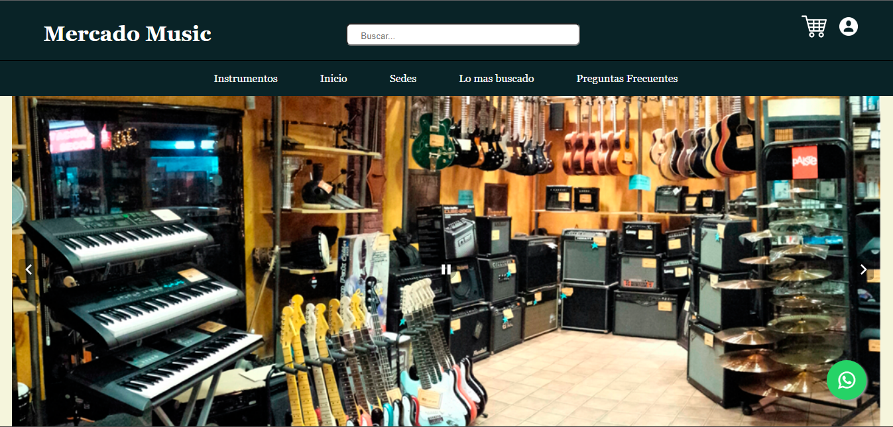
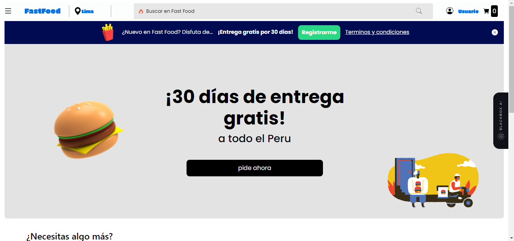

<!DOCTYPE html>
<html lang="en">
<head>
    <meta charset="UTF-8">
    <meta name="viewport" content="width=device-width, initial-scale=1.0">
    <title>Portafolio</title>
    <link href="https://cdn.jsdelivr.net/npm/bootstrap@5.0.2/dist/css/bootstrap.min.css" rel="stylesheet" integrity="sha384-EVSTQN3/azprG1Anm3QDgpJLIm9Nao0Yz1ztcQTwFspd3yD65VohhpuuCOmLASjC" crossorigin="anonymous">
    <link rel="stylesheet" href="estilo.css">
</head>
<body>
    

        <nav>
            <h3>DANY</h3>
            <ul class="nav">
                <li class="nav-item">
                  <a class="nav-link link-dark" href="#inicio">Inicio</a>
                </li>
                <li class="nav-item">
                  <a class="nav-link link-dark" href="#Sobremi">Sobre Mi</a>
                </li>
                <li class="nav-item">
                  <a class="nav-link link-dark" href="#misproyectos">Proyectos</a>
                </li>
                <li class="nav-item">
                  <a class="nav-link link-dark" href="#Contacto">Contacto</a>
                </li>
              </ul>
        </nav>

        <!--TITULO-->
        <main id="inicio">
          

            <section>
              <h1 class="display-1" id="titulo">Desarrollador Frontend</h1>

              

                  
                  
              

            </section>

            <aside class="foto_perfil">
              
            </aside>
          

          <!--SKILLS-->
          <section class="skills">
            <h2>Skills</h2>
            
            

              
              
              
            

          </section>

          <!--SOBRE MI-->
          <section class="SobreMi" id="Sobremi">
            <h4>Sobre mi</h4>

            

              

                <h5 class="card-title">DANIEL SOTERO</h5>
                
Estudiante de Computación e Informática en el instituto Cibertec de tercer Ciclo, Apto para tomar decisiones y cumplir objetivos bajo presión. Exigente de la calidad y responsabilidad. Capacidad para trabajar en equipo, proactivo, flexible al cambio manteniendo la disciplina y puntualidad correspondiente al trabajo.

                
              

            

          </section>

          <!--MIS PROYECTOS-->
          <section class="MisProyectos" id="misproyectos">
            <h4>Mis Proyectos</h4>

            

              

                

                  
                

                

                  

                    <h5 class="card-title">MERCADO MUSIC🎸</h5>
                    
Una pagina personalizada de proyecto personal para institución CIBERTEC. Hermosa y minimalista.

                    
<strong>Tecnologías usadas</strong>

                    
                    
                  

                

              

            

            

              

                

                  

                    <h5 class="card-title">Fast Food🛒</h5>
                    
Una pagina personalizada de proyecto personal para institución CIBERTEC. Hermosa y minimalista.

                    
<strong>Tecnologías usadas</strong>

                    
                    
                    
                  

                

                

                  
                

              

            

          </section>

          <section class="Contacto" id="Contacto">
            <h4>Contacto</h4>

            

              Si estás interesado en contratarme. ¡Llámame, envíame un correo electrónico o conéctate y chatea conmigo a través de LinkedIn!
            

            

              

                 

                  
                  
 +51 902308690

                 

                 

                  
                  
danielsoterofarfan1@gmail.com

                 

                 

                  
                  
 daniel-sotero-farf

                 

                
              

            

          </section>
        </main>

        <footer>
          
Creado por Daniel Sotero | Derechos de autor reservados

        </footer>
    

</body>
</html>  
